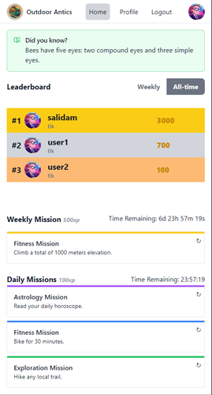
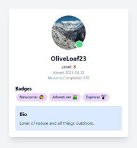

# Outdoor Antics 🌲🏞️

## 📜 Description

Outdoor Antics is an app that turns every trip outside into a fun game. Earn badges, compete on leaderboards, and embark on missions to explore the great outdoors!  

## 📚 Table of Contents
  
- [Outdoor Antics 🌲🏞️](#outdoor-antics-️)
  - [📜 Description](#-description)
  - [📚 Table of Contents](#-table-of-contents)
  - [🔧 Installation](#-installation)
    - [📖 User Story](#-user-story)
    - [✅ Acceptance Criteria](#-acceptance-criteria)
  - [🎮 Usage](#-usage)
  - [🌟 Features](#-features)
  - [Deployed Site \& Repo](#deployed-site--repo)
  - [📸 Preview Images](#-preview-images)
  - [🤝 The Team](#-the-team)
  - [🤔 Questions](#-questions)
  - [📄 License](#-license)
  - [🛠️ Badges](#️-badges)
    - [Languages](#languages)
    - [Frameworks](#frameworks)
    - [Tools](#tools)
    - [Services](#services)
    - [Other](#other)

## 🔧 Installation

1. Clone the repository to your local machine using `git clone https://github.com/Sheila-Ha/Outdoor-Adventure.git`.
2. Navigate to the project directory `cd Outdoor-Adventure`.
3. Install the required node modules by running `npm install`.
4. To start the application locally, run `npm start`. The app should open in your default web browser.
5. For production build, run `npm run build` and deploy it to a web server.

### 📖 User Story

* AS AN outdoor enthusiast  
* I WANT to have random missions generated  
* SO THAT I can explore the outdoors, earn badges, and climb the leaderboards  

### ✅ Acceptance Criteria

- GIVEN an outdoor adventure app,  
  - WHEN I open the app,  
    - THEN I am presented with options to sign up or log in.
  - WHEN I sign up,  
    - THEN I am prompted to set my preferences.
  - WHEN I log in with valid credentials,  
    - THEN I am redirected to the homepage.
  - WHEN I provide incorrect username or password,  
    - THEN I am presented with an error message and remain on the login page.
  - WHEN I am on the homepage,  
    - THEN I can view daily/weekly/monthly missions, badges, create new missions, view the leaderboard, and access my profile.
  - WHEN I receive new missions,  
    - THEN a pop-up displays the new mission details.
  - WHEN I complete a mission activity,  
    - THEN I can mark it as completed on the activity page.
  - WHEN I wish to reset an activity,  
    - THEN I can use the reset button to get a new activity.
  - WHEN I have no new missions,  
    - THEN no pop-up is displayed.
  - WHEN I view my profile,  
    - THEN I can edit my profile and update my preferences.
  - WHEN I log out,  
    - THEN I am redirected to the login page.

## 🎮 Usage

After installation:

1. Use your login credentials to access the app, or sign up if you're a new user.
2. Once logged in, explore the homepage to see your current missions and leaderboards.
3. You can complete a mission by clicking the 'Complete' button on the activity page.
4. To check your progress, visit the 'Profile' page where you can view your level, badges, and bio.
5. For additional help or to customize settings, access the app's menu.

## 🌟 Features

- Tailwind for sleek design
- Apollo & GraphQL for seamless data management
- React & Vite for efficient front-end development
- PostgreSQL for robust data storage
- Deployed on Render for universal access
- Chat GPT API integration for dynamic content

## Deployed Site & Repo  
[Outdoor Antics](https://outdoor-adventure.onrender.com)  
[Github](https://github.com/Sheila-Ha/Outdoor-Antics)

## 📸 Preview Images

  

## 🤝 The Team

- [Aleah White](mailto:aleahwhite55@gmail.com)
- [Daniel Cathey](mailto:DanTCathey@gmail.com)
- [Sheila Hanson](mailto:slhanson11@live.com)
- [Salida Maharhan](mailto:salidamaharjan@outlook.com)
- [Vicki Dunlop](mailto:vicki.dunlop@gmail.com)

## 🤔 Questions

Have a question? Reach out to us by clicking our names above!

## 📄 License 

This project is licensed under the [MIT License](https://opensource.org/licenses/MIT).

## 🛠️ Badges

### Languages

### Frameworks

### Tools

### Services

### Other

